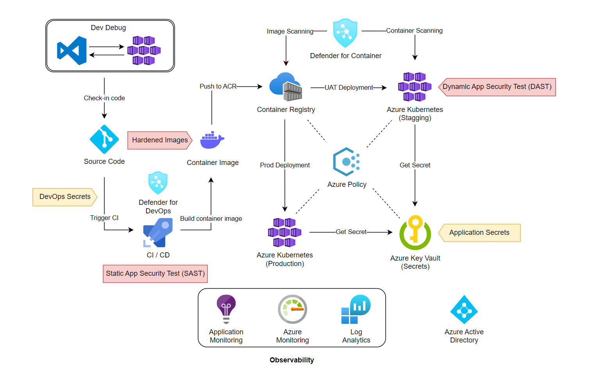

# Secure DevOps for Container Application

Container-based applications are the thing today. We have many different ways to develop and deploy them. Here I am going to share few options available in public cloud such as Azure to secure it. 

## Key Challenges
- New Vulnerabilities
- Stale Libraries
- Compromised base images
-  

## Key Principles 
- Fully Automate (DevOps)
- Clean code
- Hardened base images
- Secure images and artifacts
- Test pipeline 
- Manage secrets securely
- Observability 
- Secure pipeline 

## Proposed Architecture 
It relys on Azure but can be replaced with any standard set of tools available today.

## Key Products in use
- Azure DevOps / GitHub
- Azure Container Registry (ACR)
- Azure Kubernetes Service (AKS)
- Azure Key Vault 
- 

## Key Checkpoints
- SDLC (Security Development Lifecycle)
- Static Application Security Testing
- Dynamic Application Security Testing 
- Secure Pipeline Secrets
- Secure Application Secrets

## Observability 
- **Defender for DevOps** - Protects the DevOps Pipeline. 
- **Defender for Container** - Continiously scan the container images in registry and the containers running in Azure Kubernetes.
- **Application Monitoring** - Such as *Application Insights* Will monitor and send the application data to a central logging system.
- **Azure Monitor** - Will monitor the overall Azure infrastucture. Configurable alerts will allow automation to take an action without human intervention.   

## Conclusion
- Automate everything
- Chaos engineering
- Test in all the stages